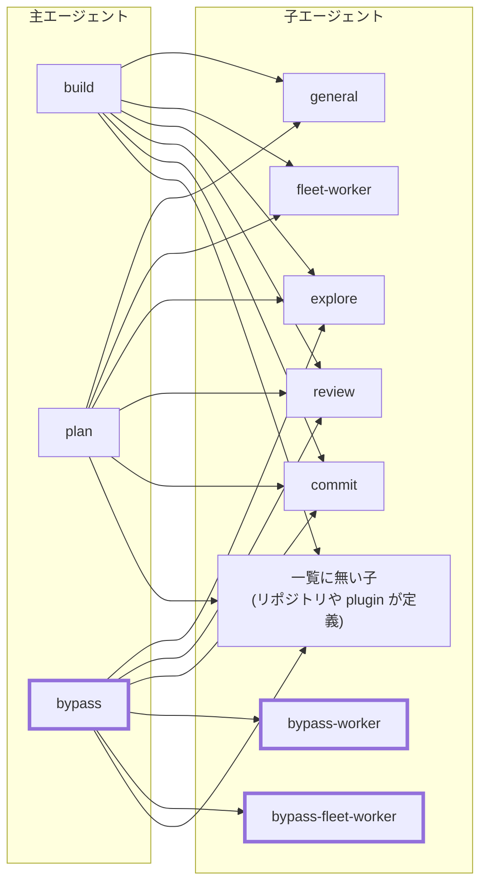
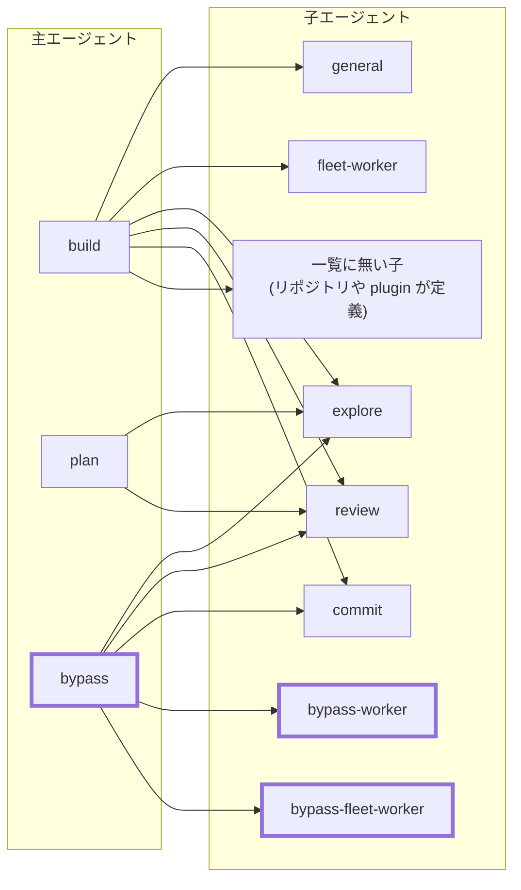

# CHG-0017: 組み込みエージェント（explore / plan）の制限が全体の設定に上書きされる問題を直す

- **状態**: In progress
- **更新日**: 2026-10-08
- **基準**: OpenCode v2.0.22、コミット f890912、WSL2 (Ubuntu)

## 目的と非目的

OpenCode の組み込みエージェントのうち、制限を持つ `explore`（読み取り専用の探索役）と
`plan`（実装前の計画役）が、本来の制限どおりに動くようにする。あわせて、`bypass`
（確認（ask）を plugin が自動で許可にする主エージェント。[ADR-0014](../adr/0014-bypass-as-ask-upgrade.md)）
から起動する子エージェントを、確認なしで動かせる範囲に整える。

きっかけは、`bypass` から起動した `explore` が shell で確認を大量に出したこと。

**利用者の方針（2026-10-08）**: 問題にするのは確認（ask）である。`bypass` と、`bypass` の上で
使う `/fleet`（依頼を分けて作業役を並列に動かすコマンド）では、利用者に聞かず、できるだけ
自動で判断させる。`build` の上で使う `/fleet` は対象にしない。利用者への質問（question）は
主エージェントが担い、子エージェントの既存の制限（`explore` と `bypass-fleet-worker` は
question を拒否）は変えない。

受入条件（実装前の期待動作）:

- `explore` は、作業ツリーと開けてある場所の探索で、shell・edit の確認を出さない。
  ファイルを書けない（`.env.example` / `.env.sample` / `.env.template` を含む）
- `plan` は、確認なしにファイルを書けない。編集できる子エージェント（`general` /
  `fleet-worker`）を起動できない。計画ファイル（`~/.opencode/plan/*`）は書けるが、
  その中でも秘密ファイルの形（`.env` / `*.key` / `secrets/` など）は書けない
- `bypass` は、一覧に載せた子（`bypass-worker` / `bypass-fleet-worker` / `explore` /
  `review` / `commit`）だけを起動できる。一覧に無い子（今後足す子、作業先のリポジトリが
  定義する子、plugin が足す子）は起動できない
- 通常の起動と `ocs`（OpenCode を Fence で隔離して起動するコマンド。[仕様](../spec/opencode-sandbox.md)）
  の両方で同じ制限が効く
- 全体の秘密ファイルの保護（read / edit の deny）を、どのエージェントでも緩めない

非目的:

- 全体の `permissions` の作り（例外の allow や、作業ツリーの外の edit の確認）を変えること。
  `build` の振る舞いが変わる
- `plan` を完全な読み取り専用にすること（MCP や内部状態の保存まで止めない）
- 作業先のリポジトリの設定（`.opencode/` や `opencode.json`）による上書きを防ぐこと。
  公式の仕様でプロジェクトの設定はグローバルに勝つ。ここで守るのは、自分の設定の下での
  事故の防止まで

## 実施計画

| 段 | 内容 | 状態 |
| --- | --- | --- |
| 0 | 原因の調査と方針のレビュー | 完了 |
| 1 | `explore` に edit / shell / subagent / question の deny を足す | 完了（未 apply） |
| 2 | `plan` を (c′) にする（edit は計画ファイル以外を拒否し、その後ろに秘密ファイルの deny を並べ直す。子は `explore` と `review` だけ。shell の静的な規則は deny を除いて確認）。エージェントごとの shell 既定を生成する仕組みを足す | 完了（未 apply） |
| 3 | `bypass` の子の起動規則を許可リストにする（全部禁止して 5 つだけ許可） | 完了（未 apply） |
| 4 | `/fleet` の指示文を直す（`plan` では計画までで止める。自動で判断させるのは `bypass` の上の `/fleet` に限ると明記）。docs を直す | 完了（未 apply） |
| 5 | 全体の `git log --output` を guide 規則で止める（別コミット。確認なしに書けることは実測済み） | 完了 |
| 6 | `chezmoi apply` 後、本物のサービスの API と probe で受入条件を確かめる | 完了（`ocs` は生成物の確認まで。実際の `ocs` の起動は未確認） |
| 7 | `bypass` から起動した読むだけの子に残る確認を、自動で判断させる方法を決めて入れる | 完了（[ADR-0015](../adr/0015-bypass-child-external-read.md)） |
| 8 | 段 7 の後の再検証（`bypass` と、そうでない主エージェントの対照。plugin が無いときに確認へ戻ること） | 完了（plugin が無いとき・一覧が壊れたときはテストでの確認。実機は `ocs`・TUI・子の再開と fork が未確認） |

状態: 未着手 / 進行中 / 完了 / 保留 / 見送り / 消滅

段 1〜3 には、それぞれ生成テストを付ける（「評価基準」の「テストで固定すること」を参照）。

## 現在地

段 0 が完了した。原因は OpenCode の仕様で、規則は「全エージェント共通の基底 → 組み込み
エージェントの追加方針 → 全体の `permissions` → エージェントの `permissions`」の順に
連結され、最後に一致したものが勝つ。全体の規則に一致した操作では、組み込みの制限が
上書きされる（[調査記録](../research/opencode/permission/builtin-agent-override.md)）。

- `explore`: 全体の `shell * ask` で shell が確認になり、`git log *` の allow で実行でき、
  `.env.example` の edit の allow で実際に書き込めた（実測）。`.env.sample` /
  `.env.template` にも同じ allow がある（実効規則の評価）
- `plan`: 実効規則の評価では、`.env.example` などの edit が確認なしで通り、`mise.toml` と
  作業ツリーの外の絶対パスの edit が拒否でなく確認になる。実機の書き込みは、モデルが
  plan モードを理由に呼ばなかったので未観測
- `plan` は組み込みでも子エージェントの起動を制限しない。`plan` → `general` の経路で、
  確認なしに作業ツリーを編集できる（実効規則上）
- `agents.explore` に deny を足すと、ツールの一覧から消え、確認ゼロで探索を終えた（実測）
- `bypass` の子の起動規則は「全部許可して `general` / `fleet-worker` を禁止」で、一覧に
  無い子も起動できる（実効規則の評価。「呼び出し関係」を参照）
- 段 1〜4 の前提の調査を 3 つ終えた（2026-10-08）
  - 元に戻す手順: 宣言を消しても配備済みのキーは残る（試作で確認）。撤去したキーを書く欄
    （`[opencode.retired.agents]`）を、元に戻すときに足す方式に決めた（「実装・検証」を参照）
  - `git log --output=<パス>` は、`build` で確認なしに書けた（作業ツリーの外にも）。
    段 5 は guide 規則（`[[opencode.shell.guide]]`。正規表現で前段で止め、説明を返す既存の
    仕組み）で止める（[調査記録 E2](../research/opencode/permission/builtin-agent-override.md#記録-e2--2026-10-08)）
  - `agents.plan` を試験用の設定で宣言すると、組み込みの規則と plan モードの指示は保たれ、
    宣言した規則が末尾に足されるだけだった。子は `explore` / `review` だけになり、計画
    ディレクトリの中の秘密ファイルも拒否された。試験用の設定で別ポートのサーバを起動すれば、
    モデルに頼らずに実効規則を取り出せる（同 E2）
- 段 1〜4 を実装した（2026-10-08。未 apply）。plan の deny の並べ直しは、生成時だけのキー
  `restate_global_deny`（全体の指定した action の deny をエージェントの規則の後ろへ写す）で
  行う。仕様は [子エージェント](../spec/agent-config-generation.md#子エージェント)。生成物の並びは
  E2 の試験用設定と action ごとには同じだが、全体の並びは違う（試験用は秘密ファイルの deny を
  計画ディレクトリの allow の直後に挟み、生成物は末尾にまとめる）。段 6 で実効規則を確かめる
- 段 5 を実装した（2026-10-08。未 apply）。`git log` で始まる部分の `--output` を guide 規則で
  止める。Claude / Copilot は OS の sandbox が書き込み先を限るので足さない。範囲と止める例・
  止めない例は [allow したコマンドの書き込み形](../spec/agent-command-policy.md#opencode-の-allow-したコマンドの書き込み形)
- 段 1〜4 を apply し、段 6 の確認をした（2026-10-08。段 5 は apply 前）。本物のサービスの
  API で取り出した実効規則を調査用の照合で評価すると、`explore` は shell / edit / 子の起動 /
  question がすべて deny（`.env.example` も）、`plan` は計画ファイル以外の edit が deny、計画
  ディレクトリの中の `.env` / `a.key` / `secrets/x.md` も deny、shell は `git log` なども ask で
  `git push` / `sudo` は deny、子は `explore` / `review` だけ。`bypass` の子は許可リストの 5 つ
  だけで、`fleet-worker` と一覧に無い名前は deny。`build` は変わらない。実機の probe では、
  `build` から起動した `explore` のツールが `glob` / `grep` / `read` / `webfetch` / `websearch`
  だけになり、確認は 1 回も出ず、`.env.example` は作られなかった
- 段 5 を apply して確かめた（2026-10-08）。実機の probe で、`build` の
  `git log -1 --output=<パス>` は guide 規則の説明（「git log の --output でファイルへ書き込まないで
  ください。…」）で拒否され、ファイルは作られなかった。同じ実行の `git log -1 --oneline` は通った
- `ocs` は、apply で生成された隔離版の定義（`rules.json` の `sandbox`）を確かめた。全体の shell の
  既定が allow の下で、`explore` は 4 つの deny、`plan` は 114 件（後ろに写した shell の規則は
  deny だけ）、`bypass` の子は許可リストの 5 つ、`git log --output` の guide 規則も入っていた。
  隔離版の `~/.config/opencode-sandbox/opencode.json` は `ocs` の起動時に `agent` / `agents` /
  `commands` を差し替えて書き出すので、次の起動で反映される。実際に `ocs` を起動しての確認はしていない
- 段 7 を apply し、段 8 の再検証をした（2026-10-08）。配備された `rules.json` に
  `bypass_child_agents`（`commit` / `explore` / `review`）が出ていた。実際の設定での probe の結果は
  次のとおり（[調査記録 E3](../research/opencode/permission/builtin-agent-override.md#記録-e3--2026-10-08)）

  | 親 → 子 | 操作 | 結果 |
  | --- | --- | --- |
  | `bypass` → `explore` | `/etc/hostname` を read、`/etc/hosts` を grep、`/etc` で `host*` を glob | 3 つとも確認なしで通った |
  | `bypass` → `review` / `commit` | `/etc/hostname` を read | 確認なしで通った |
  | `bypass` → `commit` | `workdir` を `/tmp` にして `git status` | `external_directory (/tmp/*)` の確認になり、自動で拒否された |
  | `build` → `explore` | 同じ read / grep | 確認になり、自動で拒否された |

## 未解決点

- `plan` の edit の漏れを、モデルの判断に頼らずに確かめる方法は、試験用の設定で別ポートの
  サーバを起動して API から取り出す形にした（E2）。実際に書き込ませたときの拒否は未確認
- `agents.plan` で `description` を変えたとき、`prompt` / `system` を書いたときに、組み込みの
  プロンプトが保たれるかは未確認（今回は組み込みと同じ説明だけを書く）。ほかのマシンの
  `opencode.json` に手書きの `plan` / `explore` の定義があると、宣言したキーは上書きされて
  元に戻せない。このマシンには無いことを確かめた。ほかのマシンは apply の前に確かめる
- `plan` の shell の確認が、実際に毎回人の確認になるか。「常に許可」で保存した承認は
  project 単位の allow になる（[V2 の機能調査](../research/opencode/v2-capabilities.md#既定ポリシー)）。
  `plan` で保存した承認がどう効くかは実機で確かめる
- `title` / `summary` も全体の規則で拒否が上書きされている。ツールを実行する経路が
  あるかは未確認。**再開条件**: 段 6 の後に確かめる
- 全体の `git log *` の allow 以外にも、引数で書ける形が小さく残る（`checkpoint.py paths *` の
  `--cwd` で別のリポジトリの `info/exclude` へ固定の内容を追記できる、`uv pip list *` の
  `--cache-dir`）。影響が小さいので今回は扱わない。**再開条件**: allow を足すか見直すとき
- `bypass` から起動した読むだけの子に残る確認は、段 7 で、親が `bypass` のときに作業ツリーの
  外の読み取り（`read` / `grep` / `glob` 由来の `external_directory`）の確認だけを plugin が
  省く形にした（[ADR-0015](../adr/0015-bypass-child-external-read.md)）。残るのは次のもの
  - `production.env` のような読み取りの確認と、shell 由来の `external_directory`
    （`commit` の外部のリポジトリでの git を確認なしにしないため、意図して残す）
  - 段 8 で、3 つの子と read / grep / glob、shell 由来が確認に残ることを実機で確かめた。
    子の再開・fork、対話の画面（TUI）、実際に起動した `ocs` は未確認。**再開条件**:
    これらの場面で確認が出たとき
- 共有の skill `review-loop` は、OpenCode に無い子（`code-review` / `security-review`）を
  名指ししている（既存の不整合）。段 3 の後はリポジトリがその名前の子を持っていても
  `bypass` からは呼べない。OpenCode では `review` を使い、差分の取得とコマンドでの検証は
  親が担う旨を skill に書くか決める

## 次の調査・実験

- 段 6 で、試験用でなく本物の設定に apply した後、別ポートのサーバ（E2 の方法）と probe で
  受入条件を確かめる

## 評価基準

必須:

- 受入条件をすべて満たす
- 全体の秘密ファイルの deny（read / edit）が、どのエージェントでも緩まない。エージェントに
  allow を足すときは、その後ろに秘密ファイルの deny を並べ直す
- エージェントに足すのは、deny と、それを補う最小の allow（計画ファイル、`bypass` が
  起動できる子）と、`plan` の shell の確認だけ。組み込みの方針を丸ごと写さない
  （写すと `read *` の allow などが全体の deny を上書きする）

テストで固定すること:

- `explore`: edit / shell / subagent / question が末尾で deny。`.env.example` /
  `.env.sample` / `.env.template` の edit も deny になる
- `plan`: 通常のファイルの edit は deny、計画ファイルは allow、計画ディレクトリの中の
  秘密ファイルの形は deny。子は `explore` と `review` だけ。全体で allow の shell が
  `plan` では確認になり、全体の shell の deny は deny のまま
- `bypass`: 子の起動規則の先頭が全部拒否で、許可は 5 つだけ。`general` / `fleet-worker` /
  未知の名前は拒否。古い `*` の allow が残った設定からでも置き換わる
- 役割の違う 3 つの集合（`bypass` が起動できる子・確認を自動で許可にする `bypass_agents`・
  `bypass` 以外から起動させない `guarded_subagents`）は一致させず、それぞれの期待値を固定する
- 通常の起動と `ocs` の生成物、私用と会社用（Bedrock）の生成物の両方で上の条件が成り立つ
- 手書きの定義や V1 形式の `agent.<名前>` が既にある設定と結合しても上の条件が成り立つ

調査用の照合スクリプト（`.tmp/opencode/eval_perms.py`）は公式の照合規則を再実装した
もので、shell の末尾 `*` の特例などを持たない。テストは生成物の構造で固定し、照合の
正しさは実機の API と probe で確かめる。

望ましい:

- 全体へ allow / ask を足したときに、制限のあるエージェントへ漏れたことをテストで気づける

## 候補比較

### 呼び出し関係

2026-10-08 に稼働中のサービスから API（`/api/agent/<名前>`）で取り出した実効規則を、
調査用の照合スクリプトで評価した結果。矢印は「起動できる」。太枠は確認を自動で許可に
する対象（`rules.json` の `bypass_agents`）。`title` / `summary` / `compaction` は内部用の
主エージェントで、子を起動しないので省いた。

現状:

子エージェントは、どれも子を起動できない（組み込みの拒否か、この設定の deny）。
`build` / `plan` から `bypass-worker` / `bypass-fleet-worker` は起動できない
（全体の deny と plugin の起動元の検査）。

段 2・3 の後:

`build` は変えない（`build` の上の `/fleet` は対象外）。

### 直し方の全体像

| 候補 | 支持する根拠 | 不利な点・反証 | 未検証点 | 扱い | 次の確認 |
| --- | --- | --- | --- | --- | --- |
| A. 個別に deny を足す（`agents.explore` / `agents.plan`） | 変更が小さい。`review` と同じ形。`explore` で実測済み | 全体へ規則を足すたびに影響を確かめる必要がある | `plan` の宣言の副作用 | 採用 | 段 1・2 |
| B. 組み込みの方針を末尾へ自動で写す仕組み | 全体の変更に追従する | 組み込みの `read *` の allow や `.env` の ask まで写すと、全体の秘密の deny を緩める | — | 見送り（写す内容を deny に限るなら A と同じ） | — |
| C. 全体の規則の側を変える | 根本から直る | `build` の振る舞いが変わる。例外の allow や外の edit の確認には `build` 向けの役割がある | — | 見送り | — |

### explore

| 候補 | 支持する根拠 | 不利な点・反証 | 未検証点 | 扱い | 次の確認 |
| --- | --- | --- | --- | --- | --- |
| 1. edit / shell / subagent / question を deny | 確認がほぼ出なくなり、書き込めなくなる。`build` から使っても静かになる | `git log` / `git blame` / `git ls-files` を使えない（履歴の調査は親か作業役に回す）。会社用（Bedrock）は組み込みの websearch を切って MCP の検索を使うので、会社用の `explore` には Web 検索の手段が無い（検索は親に回す） | 本物の設定への適用後の挙動 | 採用 | 段 6 |
| 2. `bypass` からだけ `explore` を禁止し、`bypass-worker` に調査させる | 変更が 1 行 | `bypass-worker` は編集でき、確認も出ないので、読むだけの調査には権限が広い。`explore` の書き込みの漏れが残る | — | 見送り | — |
| 3. `bypass` 用の読み取り専用の子 `bypass-explore` を新設 | `explore` を変えない。残る確認も自動で通る | 自作のエージェントは基底の「全部許可」から始まるので、4 つの deny では組み込みの `explore` と同じにならない（MCP や Code Mode が残る）。権限を別に設計する必要があり、定義を二重に管理する。組み込みの system プロンプトは写せない | — | 保留（段 7 で判断） | — |

### plan

| 候補 | 支持する根拠 | 不利な点・反証 | 未検証点 | 扱い | 次の確認 |
| --- | --- | --- | --- | --- | --- |
| (a) 組み込みと同じ edit の制限に戻すだけ | 最小 | `plan` → `general` で確認なしに編集できる経路が残る | — | 見送り | — |
| (b) shell と子の起動も全部拒否 | 書き換えの経路がさらに減る | `git log` などの調査ができず、計画役の価値が落ちる。MCP などがあるので完全な読み取り専用にもならない | — | 見送り | — |
| (c) (a) + 子は `explore` と `review` だけ。shell は今の全体の規則のまま | 編集できる子への委譲を塞ぐ | 全体の shell の allow に、書くもの（`check_refs.py --save`）と書ける疑いのもの（`git log --output`）がある。`ocs` では shell の既定が allow | — | 見送り（(c′) へ改めた） | — |
| (c′) (c) + shell の静的な規則は deny を除いて確認（全体の allow を引き継がない）。計画ファイルの allow の後ろに秘密ファイルの deny を並べ直す。通常の起動と `ocs` で同じ | 「直接の編集と、編集できる子への委譲は禁止し、コマンドは確認を挟む計画モード」になる。`plan` は利用者が対話で使う主エージェントなので、確認を挟んでも利用者の方針（`bypass` と `bypass` の上の `/fleet` は自動）と矛盾しない | エージェントごとの shell 既定を生成する仕組みが要る（末尾に `shell * ask` を足すだけでは既存の deny まで確認に緩める）。`plan` でもコマンドのたびに確認が出る。保存した承認や自動承認のモードがあるので、確認が毎回人の判断になるとは限らない | `agents.plan` の宣言の副作用。保存した承認の効き方。`plan` と許可する子のツール一覧（MCP など） | 採用 | 段 2 |

### bypass が起動できる子の決め方

| 候補 | 支持する根拠 | 不利な点・反証 | 未検証点 | 扱い | 次の確認 |
| --- | --- | --- | --- | --- | --- |
| 今のまま（全部許可して `general` / `fleet-worker` を禁止） | 変更なし | 今後足す承認制の子、作業先のリポジトリや plugin が定義する子も起動でき、それらの確認は自動で通らないので同じ事故が起きる | — | 見送り | — |
| 許可リスト（全部禁止して `bypass-worker` / `bypass-fleet-worker` / `explore` / `review` / `commit` を許可）。一覧は `bypass` の `permission` に直書きする | 起動できる子が明示される。全体の deny（`bypass` 専用の子を他から起動させない規則）は、`*` の allow でなく個別の allow でも上書きできるので既存の仕組みと両立する。`ocs` も同じ生成経路 | 新しい子を足すたびに一覧の更新が要る（それ自体がレビューの機会になる）。名前で許可するだけなので、同名の定義を作業先のリポジトリが上書きしても気づけない。許可する 5 つのうち `explore` / `review` / `commit` は、段 7 までは確認が残る | V1 形式の `task` を OpenCode が正規化した後の規則の順序。`bypass` の子エージェント一覧が 5 つになること | 採用 | 段 3・6 |
| 子の側に印を付けて生成器が一覧を組み立てる | 子の定義と一覧が離れない | V1 / V2 の両形式・印の除去・`ocs`・plugin 用の出力まで変更が増える。`bypass = true`（確認を自動で許可にする印）を流用すると、`explore` などが `build` から呼べなくなり、起動元に関係なく確認が自動で通る別の仕様になる | — | 見送り（複数の親で共用するようになったら再検討） | — |
| 段 7 の「親が `bypass` なら子の確認も自動で許可」だけで済ませる | 子ごとの定義が要らない | 親を辿れるか未確認。全部の子に効くので、一覧に無い子にも自動の許可が及ぶ | 親の辿り方 | 見送り（許可リストと別の軸として段 7 で扱う） | — |

### bypass のときの扱い

`bypass` 自身は確認を自動で許可にするので、効くのは deny だけである。

| 論点 | 現状 | 方針 |
| --- | --- | --- |
| `bypass` 自身への影響 | `explore` / `plan` の修正は `bypass` の規則を変えない。`plan` と `bypass` は別の主エージェントで交差しない | 変更なし |
| 書き込みの穴（`git log --output` など） | `bypass` では確認も自動で通るので、確認止まりの穴は `bypass` では塞がっていない | 拒否で止める（段 5 の guide 規則）。確認で止める作りにしない |
| `bypass` から起動できる子 | 全部許可して `general` / `fleet-worker` を禁止 | 許可リストにする（「bypass が起動できる子の決め方」と段 3） |
| 読むだけの調査の振り分け | 今回は `explore` が確認を出したので `bypass-worker` で代えた。`bypass-worker` は編集もでき、確認も出ない | 段 1 の後は `explore` を使う。`bypass-worker` は編集が要る作業に使う |
| 子に残る確認 | 下の「`bypass` から起動できる子の実効規則」のとおり、`explore` / `review` / `commit` の確認は自動で通らない | 段 7 で無くす方向で選ぶ |
| 子の question | `bypass-worker` は許可、`bypass-fleet-worker` と `explore` は拒否 | 変えない（質問は主エージェントが担う） |
| `/fleet` | `bypass` の上では `bypass-fleet-worker`、`build` の上では承認制の `fleet-worker` を使う | 自動で判断させるのは `bypass` の上の `/fleet` に限る。`build` の上の `/fleet` は確認が出るままにする |
| `ocs` の `bypass` | `ocs` は shell の既定が allow | `explore` の deny と `bypass` の許可リストは `ocs` にも出るので同じ。`plan` の shell は (c′) で確認にそろえる |

#### bypass から起動できる子の実効規則（2026-10-08）

「呼び出し関係」と同じ方法で評価した。確認を自動で許可にする対象（`rules.json` の
`bypass_agents`）は `bypass` / `bypass-worker` / `bypass-fleet-worker` の 3 つ。

| 子 | 書き込み | shell | 確認の扱い | 評価 |
| --- | --- | --- | --- | --- |
| `bypass-worker` | できる（確認は自動で許可） | 確認は自動で許可。deny は効く | 自動で許可 | 想定どおり |
| `bypass-fleet-worker` | 同上 | 同上。git の状態を変える操作は deny | 自動で許可 | 想定どおり |
| `explore` | `.env.example` / `.env.sample` / `.env.template` は確認なしで書ける（漏れ）。ほかの一部のパスは確認 | ほぼ確認。`git log` などは実行できる | **自動で通らない** | 段 1 で直す |
| `review` | deny | deny | **自動で通らない** | `external_directory` の確認だけが残りうる |
| `commit` | deny | git の読み取りだけ allow、ほかは deny | **自動で通らない** | 同上。`*--output*` の deny を自前で持つので、段 5 の穴は及ばない |

- MCP ツールと Code Mode（`execute`）は、`review` / `commit` / `bypass-worker` /
  `bypass-fleet-worker` では基底の allow のまま。今の設定で有効な MCP は会社用の検索
  サーバだけなので、今すぐの穴ではない。変更系の MCP を足すときに見直す
- 修正後の `explore` は、組み込みの拒否が保たれて MCP と Code Mode を使えない

## 仕様への変更案

| 変更対象 | 変更前 → 変更後 | 理由・証拠 | 適用結果 |
| --- | --- | --- | --- |
| `common.toml.tmpl` | `explore` の定義なし → `[opencode.agents.explore]`（description、`mode = "subagent"`、4 つの deny） | 全体の規則が組み込みの拒否を上書きし、`explore` が確認を出し `.env.example` を書けた。deny を足すとツールが一覧から消え確認ゼロになった（[調査記録](../research/opencode/permission/builtin-agent-override.md)の手順 1・2） | 未適用 |
| `common.toml.tmpl` / `generate.py` | `plan` の定義なし → `[opencode.agents.plan]`（edit は計画ファイル以外を拒否し秘密ファイルの deny を並べ直す、子は `explore` と `review` だけ、shell は deny を除いて確認） | 実効規則の評価で `plan` の edit の制限が漏れ、`plan` → `general` で確認なしに編集できる。shell の allow に書き込める形があり `ocs` では既定が allow（同手順 3 と 2 回のレビュー） | 未適用 |
| `common.toml.tmpl` の `bypass` | 子の起動規則が全部許可 → 全部禁止して 5 つだけ許可 | 一覧に無い子は確認が自動で通らず、事故が再発する（レビュー） | 未適用 |
| `common.toml.tmpl` の `/fleet` | 作業役が無い場合の分岐なし → `plan` では計画までで止める。自動で判断させるのは `bypass` の上に限ると明記 | `plan` から作業役を起動できなくなる。利用者の方針で `build` の上の `/fleet` は対象外 | 未適用 |
| `agent-config-generation.md` | 「`explore` / `review` は読むだけで確認がほぼ出ない」 → 全体の規則が組み込みの制限を上書きすることと、修正後の扱い、許可リスト | 今回の実測で、`explore` は確認を出し、書き込めた | 未適用 |
| 全体の shell | `git log *` の allow のみ → `git log` の `--output` を guide 規則で止める | `build` で `git log -1 --output=<パス>` が確認なしにファイルを作った（E2）。`*--output*` を全体で deny すると `git commit -m` の本文や正当な `--output` まで止まるので、`git log` で始まる部分だけに当てる guide 規則にする。guide 規則は `bypass` でも止まる | 未適用（実装済み。[仕様](../spec/agent-command-policy.md#opencode-の-allow-したコマンドの書き込み形)） |

## 実装・検証

段 0 の実測は[調査記録](../research/opencode/permission/builtin-agent-override.md)にある。
試験用の設定は `.tmp/opencode/probe-config/` と `.tmp/opencode/plan-config/`、実効規則の
取り出しと評価のスクリプトは `.tmp/opencode/`（いずれもコミットしない）。

**元に戻す手順（2026-10-08 に決定）。** 生成器は配備済みの `opencode.json` の
エージェントのうち、宣言したキーだけを上書きし、ほかは残す。宣言を消しても、前に書いた
キーは残る（試作の `.tmp/opencode/rollback/experiment.py` で確認）。

- `agents.explore` / `agents.plan`: 元に戻すコミットで宣言を消し、撤去したキーを書く欄
  `[opencode.retired.agents]`（例: `explore = ["description", "mode", "permissions"]`）を
  足す。生成器は書かれたキーだけを消し、空になったエントリは消す。欄と処理は元に戻すとき
  に入れる（前例: `[opencode.retired]` と `[retired_hooks]`）。試作
  （`.tmp/opencode/rollback/prototype_retire.py`）では、一度も足さなかった場合と同じ出力に
  戻った
- `agent.bypass.permission`: 宣言を以前の値に戻せば、キーごと置き換わって戻る。
  `permission` のキー自体を消すと残るので、消さない
- `ocs`: 毎回、空の設定から作り直すので、宣言を消せば消える
- どの方法でも、段 1〜3 の apply で上書きされた手書きの `description` / `permissions` は
  取り戻せない。apply の前に、各マシンの `opencode.json` に手書きの定義が無いかを確かめる

## 重要な更新

- 2026-10-08: 起票。`explore` は案 1、`plan` は (c′)、全体の直し方は A に決めた
  （2 回のレビューを経て。(c) の「shell は確認なので人の確認を通る」が成り立たない
  ことの指摘を受けて (c′) へ改めた）
- 2026-10-08: `bypass` から起動できる子の実効規則を評価し、「bypass のときの扱い」に
  追記した。利用者の方針として「問題は確認。`bypass` や `/fleet` の使い方ではできるだけ
  自動で判断させる。question は止めない」を記録し、残る確認の扱いを計画に足した
- 2026-10-08: 全体レビューを受けて改めた。自動で判断させる `/fleet` を `bypass` の上に
  限り、question は主エージェントが担い子の既存の制限は変えないと明確にした（利用者の
  判断）。計画ファイルの allow が秘密の deny を上書きする問題を受けて、deny を並べ直す
  ことを `plan` の案に加えた。段 7 の後の再検証と、元に戻す手順の検討を計画に足した
- 2026-10-08: `bypass` の子の起動規則を許可リストにする案をレビューを経て採用し、段 3 に
  した。保証するのは自分の設定の下での事故の防止までで、作業先のリポジトリによる上書きは
  対象外とした。呼び出し関係の図を足した
- 2026-10-08: 段 1〜4 の前提の調査を 3 つ終えた（元に戻す手順、`git log --output` の実測、
  `agents.plan` の試験用設定での検証）。`git log --output` は確認なしに書けたので、段 5 は
  guide 規則で止めると決めた
- 2026-10-08: 段 1〜4 を実装した。新しい生成時だけのキー `restate_global_deny` を足し、
  それを持つエージェントは deny の前段停止の例外にしないようにした
- 2026-10-08: 段 5 を実装した。`git log --output` を guide 規則で止め、allow を足すときの
  点検対象に「引数でファイルへ書けるオプション」を加えた。Claude / Copilot には足さない
  （OS の sandbox が書き込み先を限るため）
- 2026-10-08: 段 1〜5 を apply し、段 6 を終えた。残りは段 7（`bypass` から起動した読むだけの子に
  残る確認）と段 8（その後の再検証）
- 2026-10-08: 段 7 を実装した。親のセッションを `ctx.session.get` で辿れることを実測し
  （[調査記録 E3](../research/opencode/permission/builtin-agent-override.md#記録-e3--2026-10-08)）、
  案 A をレビューを経て採用した。レビューの指摘で、自動で許可するのを `read` / `grep` / `glob`
  由来の `external_directory` に限り（`commit` の shell 由来を外す）、子の一覧を起動の許可リスト
  から導出せず `[opencode.bypass_children]` に明示した。決定は ADR-0015 に記録した
- 2026-10-08: 段 7 を apply し、段 8 の再検証を終えた。実施計画の段はすべて完了した。残りは
  「未解決点」の項目
