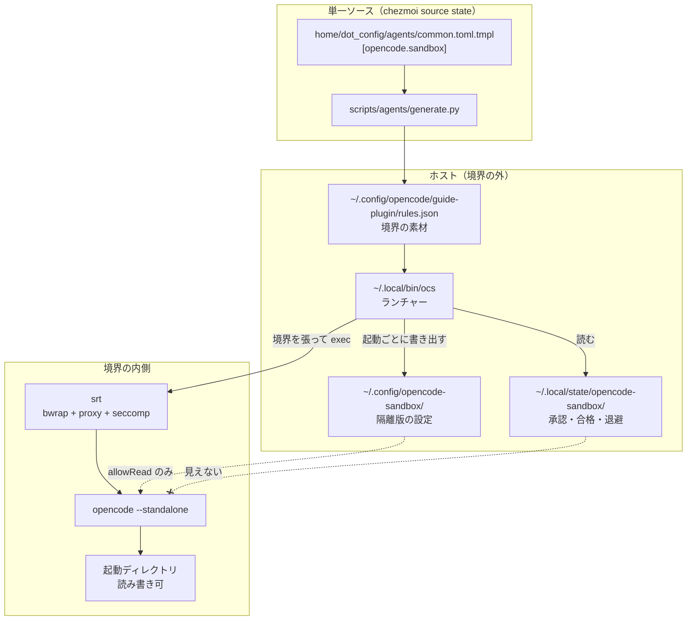
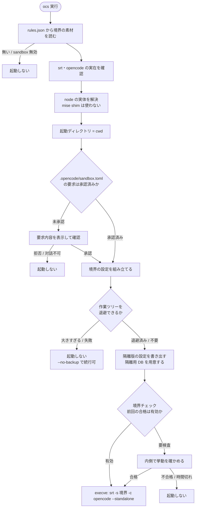
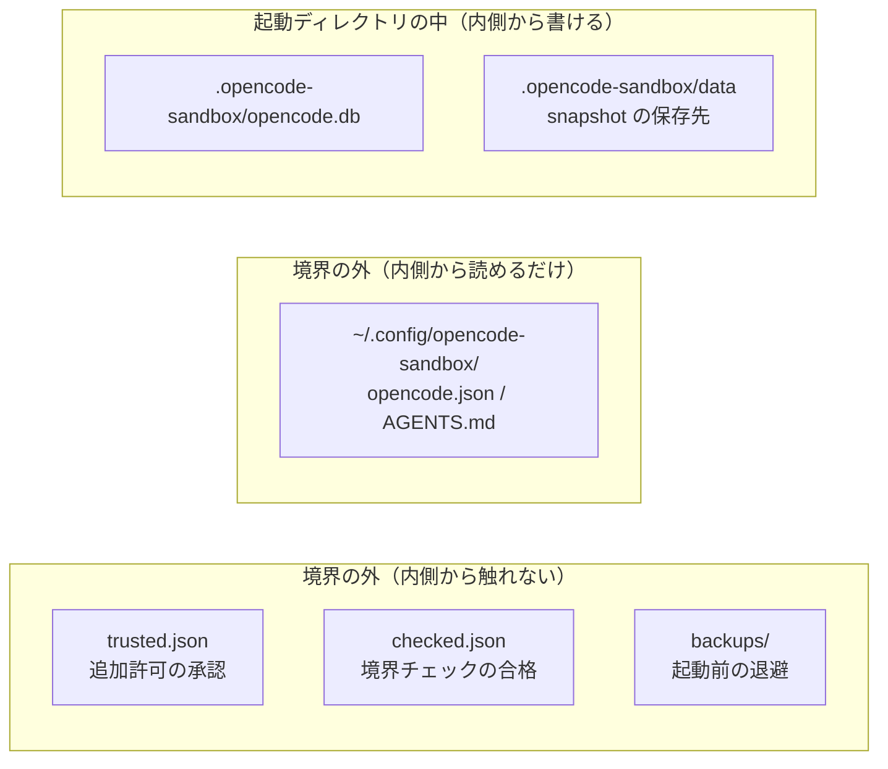
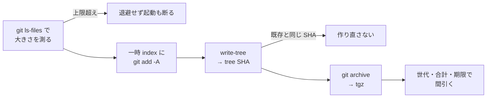

# OpenCode 隔離起動（`ocs`）のアーキテクチャ

OpenCode を OS のアクセス制御で囲って起動する仕組みの構成を書く。
**対象は Ubuntu / WSL のみ**（macOS / Windows は bwrap が無いので非対応）。

- 何を守り何を守らないか、受容しているリスクは
  [セキュリティ](security.md#ai-エージェントの実行境界ubuntu--wsl)
- そこへ至った経緯と候補比較は [CHG-0004](../change/0004-opencode-sandbox.md)
- ここは**現在の構成**だけを書く

```bash
opencode                # 境界の内側（ocs）で起動する
opencode --no-sandbox   # 素の OpenCode。境界の外での復旧・chezmoi apply 用
```

## 中心にある考え方

- **包む単位はプロセス全体**。`opencode --standalone` ごと `srt` の内側へ入れる
- コマンド文字列を検査しない。判定は「効果が境界の外に出るか」だけ
- **境界を張れないときは起動しない。** 素の OpenCode へ落とすなら境界ではない

> **なぜ shell だけでは足りないか。** OpenCode はプロジェクト設定から
> permission を上書きでき、`.opencode/plugins/` は自動ロードされ、`mcp` は
> プロセスを起動する。ツール層だけ塞いでも、同じプロセスの中から回避される
> （[permission の穴 §5](../research/opencode/permission/gaps.md#5-プロジェクト設定がグローバルの-deny-を上書きする2026-09-23-再確認)）。

## 全体像



要点は 2 つ。

- **設定の実体は境界の外**にあり、内側からは読めても書けない。
  ソース（このリポジトリ）は内側で編集できるが、**自分で有効化はできない**
- **承認・合格・退避はさらに外**（`~/.local/state`）に置く。
  内側から書けるなら、エージェントが自分で自分を承認できてしまう

## 起動シーケンス



順序で効いている点。

- **承認は境界を組み立てる前**。逆にすると、未承認の要求で境界を張ってから
  尋ねることになる
- **退避は境界を張る前**。ホスト側で行うので、内側からは改竄できない
- **チェックが判定できなければ止める。** 判定不能は合格ではない

## 境界の中身

`srt` へ渡す設定は、共通の素材 + 起動ディレクトリから毎回組み立てる。

| 区分 | 内容 |
| --- | --- |
| `allowWrite` | **起動ディレクトリ以下**、`~/.cache`、worktree の共有 `.git` |
| `allowRead` | 起動ディレクトリ、`~/.opencode`、`~/.local/share/mise`、`~/.local/bin`、`~/.config/{opencode,opencode-sandbox,shell,mise,chezmoi}`、`~/.claude/skills`、`~/.agents/skills` |
| `denyRead` | `~`、`/mnt`、`/tmp`、`/var/tmp`、`/dev/shm` |
| `denyWrite` | 起動ディレクトリ内の保護対象、worktree の `.git/{hooks,config}` |
| `network` | 許可ドメインのみ（**モデル提供元を入れ忘れると応答が来ない**） |

### 組み立ての規則

`srt` の挙動から実測で確定した規則。破ると**黙って壊れる**。

- **R1: `allowWrite` の祖先を `allowRead` に書かない。** 書くと `allowWrite` が
  無効になる。起動ディレクトリ自身は完全一致なので、両方へ入れてよい
- **R2: `read` にも `write` にも無い領域への書き込みは「成功したように見えて
  消える」。** エラーが出ないので気づけない。触りうる場所は必ずどちらかに載せる
- **R3: `denyRead` は許可領域の内側にしか効かない。** 広く塞いでから `read` で
  戻す形にする（`denyRead: ~` → `allowRead` で個別に開ける）

> **`denyRead: ~` は WSL の Windows 側を守らない。** 実測で `/mnt/c/Users` まで
> 読めていたので `/mnt` を明示的に塞いでいる。`/mnt/d` などを使うときは
> `.opencode/sandbox.toml` で狙い撃ちする（symlink 越しでも届く）。

### 保護対象（`denyWrite`）

「次回の隔離起動で、実行コード・境界設定・緩和設定の選択を決める入力一式」。
ファイル名の列挙ではなく**信頼の鎖から導出する**。

- `home/dot_config/agents`（permission / hook / 境界の単一ソース）
- `home/dot_config/opencode/guide-plugin`（生成される判定表）
- `home/dot_local/bin`（ランチャー本体）
- `scripts/agents`（生成器）
- `home/dot_config/mise`（`srt` の版を決める）
- `.opencode`（**まだ無くても塞ぐ**。置かれると自動ロードされる）

> 変更できる生成器から保護対象を次回上書きできるなら、その保護は迂回されている。
> これらを編集するときは**境界の外**で行う。

## 状態の置き場



| 置き場 | 中身 | なぜそこか |
| --- | --- | --- |
| `~/.local/state/opencode-sandbox/` | 承認・合格・退避 | 内側から書けると自分で承認・自分で合格にできる |
| `~/.config/opencode-sandbox/` | 隔離版の `opencode.json`・`AGENTS.md` | 緩和設定を内側から広げられないようにする。書き手は常に外 |
| `<起動ディレクトリ>/.opencode-sandbox/` | 隔離用 DB・snapshot | **`XDG_DATA_HOME` を永続領域へ向けないと snapshot が境界終了時に消える**（捕捉は成功したように見える） |

### 隔離用 DB

- `--standalone` は専用サーバを意味するが**専用 DB は意味しない**
- 共有すると他プロジェクトの会話が境界内へ入る（外部由来テキストの持ち込み）
- 実 DB を複製し、**資格情報と `migration` 以外を消して** `vacuum` する
  （`migration` を消すとスキーマ管理が壊れる）

境界の外から隔離版のセッションを開くときは、**`--standalone` も要る**。

```bash
OPENCODE_DB="$PWD/.opencode-sandbox/opencode.db" opencode --standalone --continue
```

> 付けないとバックグラウンドサービス（ホスト DB）へ問い合わせるので
> `OPENCODE_DB` が効かない。
> **再開先は通常版の設定になる**（permission も伏字化も効かない）。

### 隔離版の設定の書き出し方

- 緩和に関わるキー（`permissions` / `snapshots` / `policies` / `plugins`）は
  **毎回差し替える**
- それ以外のキーは**残す**。丸ごと上書きすると TUI で選んだ値が毎回消える
- 通常版からは**見た目・操作感のキーだけ**引き継ぐ
  （`theme` / `keybinds` / `username` / `layout` / `model` / `small_model`）

> 許可リストで持つこと。`permissions` や `plugins` を引き継げるようにすると、
> 境界の外の設定で内側の緩和を決められてしまう。

## 起動前の退避

境界は**ワークスペースの中を守らない**。未コミットの変更は `snapshot` でも
git でも戻せないことがあるので、起動のたびに複製を境界の外へ出す。



- **作業ツリーには触らない。** `git stash` とは別物で、一時 index に `add` して
  tree を書くだけ。再開時に変更が巻き戻ることはない
- **`.gitignore` が効く。** 隔離用 DB やキャッシュは入らない。
  裏を返すと、**無視されているファイル（`.env` など）は保護されない**
- **同じ内容なら同じ tree SHA** になるので、中断と再開を繰り返しても溜まらない
- **大きさは `git add` の前に測る。** 作ってから間引くと、巨大なリポジトリで
  `.git` を肥大させたうえに時間を使う
- **退避できなければ起動しない**（`--no-backup` で承知のうえ続行）

| 上限 | 値 |
| --- | --- |
| 退避対象の作業ツリー | 256 MiB |
| 起動ディレクトリごと | 5 世代 / 128 MiB |
| 全体 | 1 GiB |
| 保持期間 | 30 日 |

復旧は tar を展開するだけで、`.git` は要らない。

```bash
tar xzf ~/.local/state/opencode-sandbox/backups/<リポジトリ>/<日時>-<tree>.tgz -C <復元先>
```

## 境界チェック

起動前に、境界の内側で**挙動を**確かめる。

- ホストの秘密（`~/.ssh` 等）が見えないこと
- WSL なら `/mnt/c` が見えないこと
- 作業領域へ書けること
- `XDG_DATA_HOME` が永続領域を指していること
- 保護対象へ書けない／作れないこと
- 許可外ドメインへ出られないこと（**許可済みドメインを対照に使う**）

判定の作法。

- **値を根拠にしない。** `/proc/self/status` の `Seccomp:2` は親環境由来でも
  同じ値になる
- **エラーコード単独でも判定しない。** `ECONNREFUSED` は「待ち受けていない
  だけ」かもしれない
- **proxy の起動を待つ。** 生成直後は待ち受けておらず、待たずに「到達しない」と
  判定すると**穴が開いていても合格になる**
- 合格は**判定に効く入力のハッシュ**（境界設定・`srt`・`opencode`・検査script）と
  24 時間の期限つきで再利用する。`--recheck` でやり直す

## コマンドとフラグ

`ocs` が解釈しない引数は、そのまま OpenCode へ渡る（`ocs --continue` など）。

| フラグ | 用途 |
| --- | --- |
| `--no-backup` | 起動前の退避をしない |
| `--recheck` | 前回の合格を使わず境界チェックをやり直す |
| `--trust` | `.opencode/sandbox.toml` の要求を確認せず承認する（自動化用） |

> **`srt -c` はコマンド文字列を 1 個しか取らない。** 後ろへ並べた引数は
> `srt` の位置引数になり、**エラーも出さずに捨てられる**。渡したい引数は
> 必ずコマンド文字列の中へ入れる。

## 信頼の鎖

ランチャーは**境界が張られる前にホストで動く**。したがって次を守る。

- 実体を絶対パスで呼ぶ（`node` / `git` の差し替えを防ぐ）
- **mise の shim を経由しない。** shim は mise 本体への symlink で、呼ぶたびに
  版解決とネットワーク確認が走り停止しうる。加えて mise はワークスペース内の
  設定を読むので、**境界を張る前に可変な入力へ依存する**ことになる
- ワークスペース内のコード（mise タスク・シェル設定）を経由しない
- 境界の設定は `denyWrite` で保護された生成物だけを読む
- 内側へ渡す環境変数から資格情報を落とす
  （`GH_TOKEN` / `SSH_AUTH_SOCK` / `AWS_*` など）

## 版の扱い（未固定）

`srt` は **research preview** であり、README が明記している。

> As this is an early research preview, APIs and configuration formats may evolve.

一方、導入は浮動指定のまま。**Claude Code と同じ実体を共有している**ので、
更新は両方へ同時に効く。

```toml
# home/dot_config/mise/config.toml.tmpl
"npm:@anthropic-ai/sandbox-runtime" = "latest"
```

| 依存の仕方 | 対象 | 設定フォーマット変更の影響 |
| --- | --- | --- |
| CLI + 設定 JSON | **`ocs`** | 境界の組み立てが通らなくなりうる |
| `vendor/seccomp/apply-seccomp` のみ | Claude Code | パスが変われば seccomp が無効化される |

**現状は「固定せず、起動時チェックで検知する」を選んでいる。**
境界チェックは挙動で判定し、判定できなければ起動しないので、
壊れた場合は**起動を断る形で気づける**（fail-closed）。

- 更新時は「正常なコマンドが通る」ではなく
  **「拒否すべきものが拒否される」**ことを確かめる
  （deny・直接通信・Unix socket・cwd 違い・並行実行）
- `--recheck` で前回の合格を捨てて検査し直す
- 版を固定する場合は `latest` を実際の版へ置き換える。
  そのとき `seccomp_apply_path` も同じ版を指す必要がある
  （[エージェント権限仕様](agent-permissions.md#wsl2-での抜け穴-seccomp-フィルタ)）

> **検知できるのは「境界が壊れたこと」までで、「設定の意味が変わったこと」は
> 検知できない。** 例えば新しい許可キーが増え、既定値が緩い方向であっても、
> チェック項目に無ければ合格する。更新時は変更履歴も読むこと。

## 既知の制約

| 制約 | 内容 |
| --- | --- |
| セッション中に境界を変えられない | bwrap の名前空間はプロセス起動時に作られる。`/add-dir` 相当は無い |
| コマンド単位の逃げ道が無い | プロセス単位で包む以上、`dangerouslyDisableSandbox` 相当は作れない |
| 履歴・設定が通常版と分かれる | DB を分けているため。セッションの移送は `session export` / `import` |
| 境界はエージェントから見えない | `ENOENT` を「存在しない」と誤診する。`AGENTS.md` で明示的に伝えている |
| `read` が既定で拒否 | Claude Code は既定で全許可。参照したい場所は個別に開ける必要がある |

[仕様一覧へ戻る](index.md)
