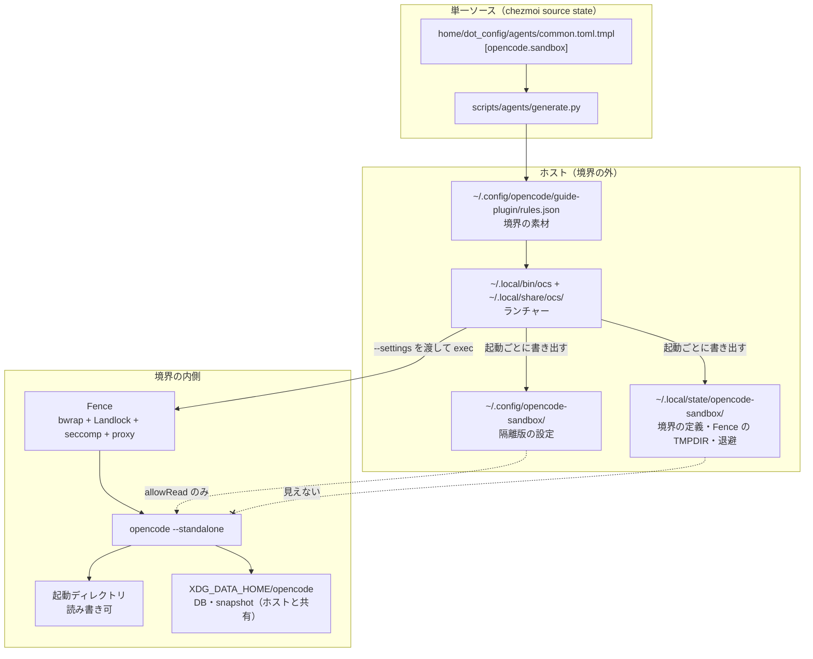
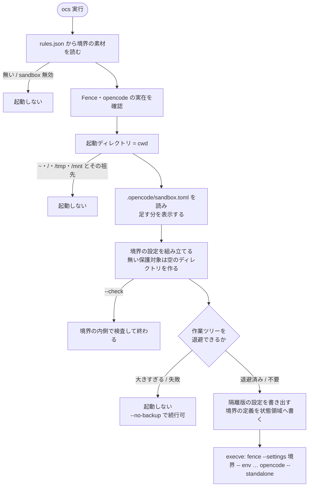
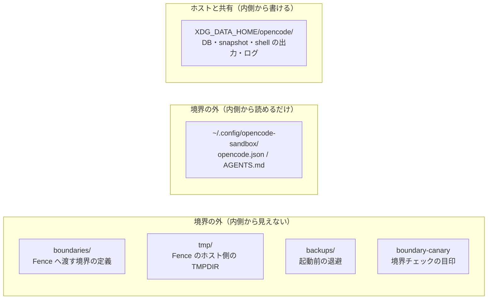
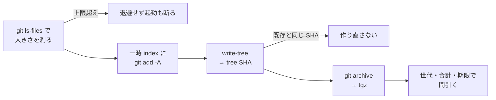

# OpenCode 隔離起動（`ocs`）のアーキテクチャ

OpenCode を OS のアクセス制御で囲って起動する仕組みの構成を書く。
**対象は Ubuntu / WSL のみ**（macOS / Windows は bubblewrap が無いので非対応）。

- 何を守り何を守らないかは [ADR-0012](../adr/0012-ocs-boundary-for-accidents.md)
  （目的は**エージェントのうっかりの防止**。悪意あるワークスペースやプロンプト
  インジェクションへの耐性は非目的）と [セキュリティ](security.md#ai-エージェントの実行境界ubuntu--wsl)
- 経緯と候補比較は [CHG-0004](../change/closed/0004-opencode-sandbox.md)（作った経緯）と
  [CHG-0009](../change/closed/0009-ocs-simplify-for-accidents.md)（Fence への切り替えと簡素化）
- ここは**現在の構成**だけを書く

```bash
ocs          # 隔離起動（境界の内側で起動する）
ocs --check  # 起動せず、この起動ディレクトリの境界を内側から検査する
opencode     # 通常起動（境界なし）
```

## 中心にある考え方

- **包む単位はプロセス全体**。`opencode --standalone` ごと [Fence](https://github.com/fencesandbox/fence)
  （bubblewrap・Landlock・seccomp とドメイン単位のプロキシ）の内側へ入れる
- コマンド文字列を検査しない。判定は「効果が境界の外に出るか」だけ
- **境界を張れないときは起動しない。** 通常起動へ落とすなら境界ではない
- **守るのは「境界の外」であって「境界の中」ではない。** 起動ディレクトリ以下は
  無条件に読み書きできる。**モデル API の資格情報も内側にある**（DB の中。
  [既知の制約](#既知の制約)）
- **履歴は通常起動と共有する。** DB とデータディレクトリ（`XDG_DATA_HOME/opencode`）を
  境界の内外で同じものにする。内側で作ったセッションは外の `opencode -s <ID>` で再開できる

> **なぜ shell だけでは足りないか。** OpenCode はプロジェクト設定から
> permission を上書きでき、`.opencode/plugins/` は自動ロードされ、`mcp` は
> プロセスを起動する。ツール層だけ塞いでも、同じプロセスの中から回避される
> （[permission の穴 §5](../research/opencode/permission/gaps.md#5-プロジェクト設定がグローバルの-deny-を上書きする2026-09-23-再確認)）。

## 全体像


```mermaid
flowchart TD
    subgraph source["単一ソース（chezmoi source state）"]
        COMMON["home/dot_config/agents/common.toml.tmpl<br>[opencode.sandbox]"]
        GEN["scripts/agents/generate.py"]
    end

    subgraph host["ホスト（境界の外）"]
        RULES["~/.config/opencode/guide-plugin/rules.json<br>境界の素材"]
        OCS["~/.local/bin/ocs + ~/.local/share/ocs/<br>ランチャー"]
        STATE["~/.local/state/opencode-sandbox/<br>境界の定義・Fence の TMPDIR・退避"]
        CFG["~/.config/opencode-sandbox/<br>隔離版の設定"]
    end

    subgraph inside["境界の内側"]
        FENCE["Fence<br>bwrap + Landlock + seccomp + proxy"]
        OC["opencode --standalone"]
        WS["起動ディレクトリ<br>読み書き可"]
        DATA["XDG_DATA_HOME/opencode<br>DB・snapshot（ホストと共有）"]
    end

    COMMON --> GEN --> RULES
    RULES --> OCS
    OCS -- "起動ごとに書き出す" --> STATE
    OCS -- "起動ごとに書き出す" --> CFG
    OCS -- "--settings を渡して exec" --> FENCE
    FENCE --> OC
    OC --> WS
    OC --> DATA
    CFG -. "allowRead のみ" .-> OC
    STATE -. "見えない" .-x OC
```

要点は 2 つ。

- **設定の実体は境界の外**にあり、内側からは読めても書けない。
  ソース（このリポジトリ）は内側で編集できるが、**自分で有効化はできない**
  （[保護対象](#保護対象denywrite)）
- **境界の定義と退避はさらに外**（`~/.local/state`）に置く。内側からは見えない

## 起動シーケンス


```mermaid
flowchart TD
    START(["ocs 実行"]) --> LOAD["rules.json から境界の素材を読む"]
    LOAD -->|"無い / sandbox 無効"| STOP1["起動しない"]
    LOAD --> BIN["Fence・opencode の実在を確認"]
    BIN --> WSDIR["起動ディレクトリ = cwd"]
    WSDIR -->|"~・/・/tmp・/mnt とその祖先"| STOP2["起動しない"]
    WSDIR --> REQ[".opencode/sandbox.toml を読み<br>足す分を表示する"]
    REQ --> BUILD["境界の設定を組み立てる<br>無い保護対象は空のディレクトリを作る"]
    BUILD -->|"--check"| CHECK["境界の内側で検査して終わる"]
    BUILD --> BACKUP{"作業ツリーを<br>退避できるか"}
    BACKUP -->|"大きすぎる / 失敗"| STOP3["起動しない<br>--no-backup で続行可"]
    BACKUP -->|"退避済み / 不要"| WRITE["隔離版の設定を書き出す<br>境界の定義を状態領域へ書く"]
    WRITE --> EXEC["execve: fence --settings 境界 -- env … opencode --standalone"]
```

順序で効いている点。

- **起動ディレクトリの制限は境界を組み立てる前**。広すぎる場所で境界を一度作ってから
  捨てることにしない
- **退避は境界を張る前**。ホスト側で行うので、内側からは改竄できない
- 起動時に確認や検査で待たない。境界チェックは `ocs --check` で手動で走らせる
  （[境界チェック](#境界チェック)）

## 境界の中身

Fence へ渡す設定（`fence.json` の形）は、共通の素材 + 起動ディレクトリから毎回組み立てる。
素材は `common.toml.tmpl` の `[opencode.sandbox]`。

| 区分 | 内容 |
| --- | --- |
| `defaultDenyRead` | `true`。読み取りは既定で拒否し、下の `allowRead` と書き込み先だけを開ける |
| `allowRead` | 起動ディレクトリ、`read`（道具の置き場: `~/.opencode`、`~/.local/share/mise`、`~/.local/bin`、`~/.config/opencode/{guide-plugin,checkpoint-plugin,skills}`、`~/.config/{opencode-sandbox,shell,mise,chezmoi,git}`、`~/.gitconfig`、`~/.claude/skills`、`~/.agents/skills`）、`work_read`（作業用の親ディレクトリ: `~/src`・`~/worktrees`・`~/papers`・`~/.local/share/chezmoi`） |
| `allowWrite` | 起動ディレクトリ、`write`（`~/.cache`）、`XDG_DATA_HOME/opencode`、worktree の共有 `.git` |
| `denyRead` | 開けた場所の内側にある秘密（`deny_read` と `[sandbox] deny` のうち glob でないもの） |
| `denyWrite` | [保護対象](#保護対象denywrite)、worktree の共有 `.git` の `hooks` と `config` |
| `network` | 通信を許可したドメインのみ（**モデル提供元を入れ忘れると応答が来ない**）。接続先は `[provider.*]` から `providers` で引く（[CHG-0007](../change/0007-harness-profiles.md)） |
| `allowPty` | `true`。TUI のリサイズを内側へ伝える |

### 組み立ての規則

- **無いパスは渡さない。** `read`・`work_read`・`write` は起動時に在るものだけを使う。
  機械ごとに `~/papers` などが無くてよい
- **読める場所を並べる形にする。** 「全部読めて秘密だけ名指しで隠す」形では、
  新しくできた秘密の置き場が既定で見える。`work_read` には秘密を置かない場所だけを書き、
  **中に紛れた秘密は読める**ことを受け入れる（ADR-0012）
- **`~/.config/opencode` は丸ごと開けない。** `service.json`（常駐サービスの接続情報）が
  ある。要る plugin とスキルだけを開ける
- **`denyRead` は、ホーム配下なら開けた場所の内側にあるものだけを渡す。**
  開けていない場所は元から見えない。ホームの外（`/run/user` など、Fence が既定で
  見せる場所）は在れば渡す。例: `~/.config/chezmoi` を開けているので
  `~/.config/chezmoi/key.txt`（age の秘密鍵）は `/dev/null` で隠れる
- **Fence が既定で読ませる場所がある。** `/usr`・`/etc`・`/opt`・`/run` などのシステムの
  パスと、`~/.local/bin`・`~/.cargo/bin`・`~/.rustup`・`~/.nvm` などの道具の置き場。
  `/run/user`（常駐サービスや agent のソケット）は `deny_read` で隠す
- **`~/.bashrc`・`.gitconfig` などは Fence が読み込み専用にする。** 開けていないものは
  `/dev/null` で潰され、名前だけ見える
- **`/tmp` は内側だけの tmpfs。** 書けるがホストへは反映されず、終了時に消える
- **Fence には必ず `--settings` を渡す。** 省くとカレントディレクトリとその親から
  `fence.json` を探すので、リポジトリが境界を決められてしまう

> WSL の `/mnt/c` は `defaultDenyRead` で見えない（存在も分からない）。
> `/mnt/d` などを使うときは `.opencode/sandbox.toml` で開ける
> （[プロジェクトごとの追加](#プロジェクトごとの追加)）。

### 起動ディレクトリの制限

起動ディレクトリは無条件に書ける。**`unsafe_workspace` の項目そのもの、またはその
祖先では起動しない**（`~`・`/mnt`・`/tmp`・`/var/tmp`・`/dev/shm`）。

| 起動ディレクトリ | 判定 | 理由 |
| --- | --- | --- |
| `~`、`/home`、`/` | **拒否** | ホーム全体が書ける |
| `/tmp`、`/mnt` | **拒否** | ホストの `/tmp` や Windows 側が書ける |
| `~/work/repo`、`/tmp/scratch` | 許可 | 子孫なので書ける範囲がそこに留まる |

### 保護対象（`denyWrite`）

「次回の隔離起動で、実行コード・境界設定・緩和設定の選択を決める入力一式」。
ファイル名の列挙ではなく**信頼の鎖から導出する**。起動ディレクトリ相対で書く
（`[opencode.sandbox] protected`）。

- `home/dot_config/agents`（permission / hook / 境界の単一ソース）
- `home/dot_config/opencode/guide-plugin`（生成される判定表）
- `home/dot_local/bin`（ランチャーの入口と境界チェック）
- `home/dot_local/share/ocs`（ランチャーの本体。[構成](#ランチャーの構成)）
- `scripts/agents`（生成器）
- `home/dot_config/mise`（Fence の版を決める）
- `.opencode`（置かれると自動ロードされる）

**Fence の `denyWrite` はまだ無いパスに効かない**（[実測](../research/opencode/permission/fence.md)の 4'）。
そこで `ocs` は、無い保護対象のうち**親が在るものを空のディレクトリとして先に作ってから**
塞ぐ。`.opencode` は起動ディレクトリに必ず作られる（空のディレクトリは `git status` に
出ない）。親が無いもの（このリポジトリ以外での `home/dot_config/agents` など）は、
その起動ディレクトリでは守る意味が無いので渡さない。塞いだディレクトリは
マウントポイントなので、内側から消したり名前を変えたりもできない。

> 変更できる生成器から保護対象を次回上書きできるなら、その保護は迂回されている。
> これらを編集するときは**境界の外**で行う。

### プロジェクトごとの追加

`<起動ディレクトリ>/.opencode/sandbox.toml` に書くと、その起動ディレクトリでだけ足す。
宣言がリポジトリと一緒に移動し、パスがマシン依存にならない。

```toml
read = ["/mnt/d/datasets/example"]
write = ["/mnt/d/outputs/example"]
network_allow = ["api.example.com"]
```

- **確認なしで適用し、起動時に足す分を表示する。** 承認の記録は持たない
- 知らないキー・文字列の配列でない値があれば起動しない
- `~` は展開し、相対パスは起動ディレクトリ基準にする
- 親ディレクトリの宣言は子に効かない（起動ディレクトリのものだけを見る）
- `.opencode` は保護対象なので、内側から宣言を書き換えることはできない

## 状態の置き場


```mermaid
flowchart LR
    subgraph outside["境界の外（内側から見えない）"]
        BOUNDARIES["boundaries/<br>Fence へ渡す境界の定義"]
        TMP["tmp/<br>Fence のホスト側の TMPDIR"]
        BACKUPS["backups/<br>起動前の退避"]
        CANARY["boundary-canary<br>境界チェックの目印"]
    end
    subgraph readonly["境界の外（内側から読めるだけ）"]
        SBCFG["~/.config/opencode-sandbox/<br>opencode.json / AGENTS.md"]
    end
    subgraph shared["ホストと共有（内側から書ける）"]
        DATA["XDG_DATA_HOME/opencode/<br>DB・snapshot・shell の出力・ログ"]
    end
```

| 置き場 | 中身 | なぜそこか |
| --- | --- | --- |
| `~/.local/state/opencode-sandbox/` | 境界の定義・Fence の TMPDIR・退避・目印 | 内側から書き換えられない場所。chezmoi が apply で先に作る（[信頼の鎖](#信頼の鎖)） |
| `~/.config/opencode-sandbox/` | 隔離版の `opencode.json`・`AGENTS.md` | 緩和設定を内側から広げられないようにする。書き手は常に外 |
| `XDG_DATA_HOME/opencode/` | DB・snapshot・shell の出力・ログ | 通常起動と共有する（下記） |

- **境界の定義は起動ごとに書き、24 時間より古いものを次の起動で捨てる。**
  `execve` で置き換わるので自分では消せない
- **Fence のホスト側の `TMPDIR` は `tmp/` に固定する。** Fence は起動ごとに
  `fence-seccomp/*.bpf` を残すので、10 分より古いものを次の起動で捨てる。
  プロキシのソケットもここに作られ、Fence が終了時に消す
- 内側の `TMPDIR` は `/tmp`（内側の tmpfs）に戻す。ホスト側の値のままだと、
  内側から見えない場所を指したまま書けない

### DB の共有

内側で `XDG_DATA_HOME` と `OPENCODE_DB` を上書きしない。`ocs` は外側で
`XDG_DATA_HOME/opencode`（未設定なら `~/.local/share/opencode`）を解決し、
`allowWrite` に入れる。利用者の環境の `OPENCODE_DB` は**落とす**（残ると常駐サービスと
別の DB を使い、履歴が分かれる）。

- 同時書き込み・外での再開・外からの `/undo` は実測で通った
  （[DB の共有の調査](../research/opencode/shared-db.md)、CHG-0009 の実装・検証）
- **`~/.local/state/opencode/` は開けない。** 常駐サービスの接続情報 `service.json` がある。
  opencode は起動時にそこへディレクトリを作るので、内側の `XDG_STATE_HOME` は
  `/tmp/xdg-state`（内側の tmpfs）へ向ける。内側で選んだモデルと入力履歴は残らない
- **同じセッションを境界の内と外で同時に開かない**（同時の操作は未検証）
- OpenCode を更新したら常駐サービスも再起動する。古い版の常駐サービスと新しい版の
  内側が同じ DB を使うと、スキーマの移行で壊れうる（推測）

### セッションの引き継ぎ

DB を共有しているので、内側で作ったセッションは OpenCode が終了時に表示する
`opencode -s <ID>` で**そのまま**外から再開できる。移送の操作は無い。

> 以前の `ocs` は起動ディレクトリごとの隔離用 DB（`<起動ディレクトリ>/.opencode-sandbox/`）を
> 使っていた。`ocs` はこれを消さない。中の古いセッションは次で開ける（`--standalone` が要る）。
>
> ```bash
> OPENCODE_DB="$PWD/.opencode-sandbox/opencode.db" opencode --standalone
> ```
>
> 要らなければ `.opencode-sandbox/` ごと消してよい。`.opencode-sandbox/data/mise` は、
> 境界の内側の mise が導入済みの道具を見つけられずに入れ直したもので、消してよい。
> 以前の承認と合格の記録（`~/.local/state/opencode-sandbox/trusted.json`・`checked.json`）も
> 使われないので消してよい。

### 隔離版の設定の書き出し方

- 緩和に関わるキー（`permissions` / `snapshots` / `policies` / `plugins`）は
  **毎回差し替える**。生成側が空なら取り除く（`AGENTS.md` も同じ）。
  `permissions` だけは空でも `[]` を書く（消すと OpenCode の既定に戻るため）
- それ以外のキーは**残す**。丸ごと上書きすると TUI で選んだ値が毎回消える
- 通常版の設定からは**見た目・操作感のキーだけ**引き継ぐ
  （`theme` / `keybinds` / `username` / `layout` / `model` / `small_model`）
- 既定モデルは初回だけ、`model_preference` の順で DB に資格情報がある provider を選ぶ

> 許可リストで持つこと。`permissions` や `plugins` を引き継げるようにすると、
> 境界の外の設定で内側の緩和を決められてしまう。

内側の環境には `OCS_ISOLATED=1` を渡す。guide plugin はこれで隔離起動を見分け、
確認画面の説明の生成だけを止める（隔離起動では `tui.ts` を読まず、作っても
表示されないため）。偽装されても説明が出なくなるだけで、判定には効かない。

## 起動前の退避

境界は**ワークスペースの中を守らない**。未コミットの変更は `snapshot` でも
git でも戻せないことがあるので、起動のたびに複製を境界の外へ出す。


```mermaid
flowchart LR
    A["git ls-files で<br>大きさを測る"] -->|"上限超え"| STOP["退避せず起動も断る"]
    A --> B["一時 index に<br>git add -A"]
    B --> C["write-tree<br>→ tree SHA"]
    C -->|"既存と同じ SHA"| SKIP["作り直さない"]
    C --> D["git archive<br>→ tgz"]
    D --> E["世代・合計・期限で<br>間引く"]
```

- **作業ツリーには触らない。** `git stash` とは別物で、一時 index に `add` して
  tree を書くだけ。再開時に変更が巻き戻ることはない
- **`.gitignore` が効く。** キャッシュなどは入らない。
  裏を返すと、**無視されているファイル（`.env` など）は保護されない**
- **同じ内容なら同じ tree SHA** になるので、中断と再開を繰り返しても溜まらない
- **大きさは `git add` の前に測る。** 作ってから間引くと、巨大なリポジトリで
  `.git` を肥大させたうえに時間を使う
- **コミットが無いリポジトリでも退避できる。** 一時 index は HEAD の tree か、
  コミットが無ければ空（`read-tree --empty`）で始める
- **利用者の環境の `GIT_*` は git へ渡さない。** `GIT_DIR` / `GIT_INDEX_FILE` などが
  残っていると、退避や worktree の判定の対象が別のリポジトリにずれる
- **退避できなければ起動しない**（`--no-backup` で承知のうえ続行）

| 上限 | 値 |
| --- | --- |
| 退避対象の作業ツリー | 256 MiB |
| 起動ディレクトリごと | 5 世代 / 128 MiB |
| 全体 | 1 GiB |
| 保持期間 | 30 日 |

復旧は tar を展開するだけで、`.git` は要らない。

```bash
tar xzf ~/.local/state/opencode-sandbox/backups/<リポジトリ>/<日時>-<tree>.tgz -C <復元先>
```

## 境界チェック

`ocs --check` で、その起動ディレクトリの境界を張り、内側で**挙動を**確かめる。
起動はしない。終了コードは 0 が合格。起動時には走らせない（待ちをなくすため）。
Fence や境界の素材を変えたとき、OpenCode や Fence を更新したときに走らせる。

- ホストの秘密（`~/.ssh`・`~/.git-credentials`・`~/.config/gh`・`~/.config/chezmoi/key.txt`）、
  常駐サービスの接続情報（`XDG_STATE_HOME/opencode/service.json`）、目印が**読めない**こと
- WSL なら `/mnt/c/Users`・`/mnt/c/Windows` が**読めない**こと
- 作業領域と `XDG_DATA_HOME/opencode` へ書けること
- 保護対象へ書けない／作れないこと
- 許可外ドメインへ出られないこと（**許可済みドメインを対照に使う**）

判定の作法。

- **在るかではなく読めるかで判定する。** WSL の `/mnt/c` は、Landlock で読めなくても
  stat は通ることがある。ディレクトリは中身が 1 件でも見えれば、通常ファイルは
  開ければ不合格。隠した結果の空の tmpfs と `/dev/null` は「読めない」に数える。
  中身は読まない
- **エラーコード単独で判定しない。** `ECONNREFUSED` は「待ち受けていないだけ」かもしれない
- **隠す対象はホストに在るものだけで判定する。** `ocs` が境界の外で存在を確かめ、
  在るものを `BOUNDARY_HIDDEN`、無いものを `BOUNDARY_HIDDEN_ABSENT`（`SKIP` と表示）で渡す
- **目印を必ず 1 件検査する。** `~/.ssh` などが 1 つも無い機械でも隔離を確かめられるよう、
  `ocs` が `~/.local/state/opencode-sandbox/boundary-canary` をホストに置く。
  read / write に載せてはいけない
- **検査スクリプトは PATH を `/usr/bin:/bin` に固定し、`curl` を絶対パスで呼ぶ。**
  試験用の `BOUNDARY_CURL` は `ocs` が利用者の環境から取り除く
- **パスは改行区切りの環境変数で渡す**（`BOUNDARY_HIDDEN` / `BOUNDARY_PROTECTED`）。
  空白や glob 文字を含むパスを割らないため。改行を含むパスでは検査しない
- **保護対象が通常ファイルのときは追記（`>>`）で書き込み可否を見る。**
  `mkdir` の失敗を合格と読むと、書けるのに合格する。`>` は中身を切り詰めるので使わない
- **検査スクリプトが無ければ不合格。** 判定できないことを合格にしない

## コマンドとフラグ

`ocs` が解釈しない引数は、そのまま OpenCode へ渡る（`ocs --continue`、`ocs -s <ID>` など）。
Fence へは引数を並べて渡すので、引用の心配は無い。

| フラグ | 用途 |
| --- | --- |
| `--no-backup` | 起動前の退避をしない |
| `--check` | 起動せず、境界を内側から検査する（[境界チェック](#境界チェック)） |

## 信頼の鎖

ランチャーは**境界が張られる前にホストで動く**。ADR-0012 で、ワークスペースが
ホストで動く処理を騙すことは非目的にした。そのうえで、誤動作を防ぐために次を守る。

- 実体を絶対パスで呼ぶ（Fence・`opencode`・`/usr/bin/git`）
- **Fence には PATH を `/usr/bin:/bin` に固定して渡す。** Fence は境界を張る前に
  `bwrap` / `socat` / `bash` を PATH から探して動かす。内側の opencode には、
  コマンドを `/usr/bin/env PATH=<利用者の PATH> TMPDIR=/tmp XDG_STATE_HOME=/tmp/xdg-state opencode …`
  にして利用者の PATH を戻す（mise の道具が要る）
- 境界の設定は `denyWrite` で保護された生成ファイル（`rules.json`）だけから組む
- 境界の定義は**ワークスペースの外**（`boundaries/`）へ書く。内側から書ける場所に置くと、
  Fence が読む前に書き換えられる
- 内側へ渡す環境変数から資格情報を落とす（`GH_TOKEN` / `SSH_AUTH_SOCK` / `AWS_*` など）。
  `OPENCODE_CONFIG` と `OPENCODE_DB` も落とす
- **ランチャーが読み込むコードは、入口と同じだけ保護する。** 本体を別ファイルへ
  分けた分だけ鎖が延びるので、置き場・読み込み方・配布先を入口に揃える（下記）
- **状態領域（`~/.local/state/opencode-sandbox/`）は、ほかの CLI からも書けなくする。**
  `~/.local/state` は Claude / Copilot の sandbox の書き込みの許可に入っているので、
  `[sandbox] deny` と `[file] write_deny_globs` で名指しして塞ぐ
  - **Copilot は、セッション開始時に無いパスの deny を捨て、途中で作られても
    効かせない**（[実測](agent-sandbox.md#実測した既定の許可範囲-wsl2-chezmoi-リポジトリを-cwd-として-sandbox-policy)）。`ocs` を初めて起動する前はこの
    ディレクトリが無いので、chezmoi が apply で先に作る
    （`home/dot_local/state/private_opencode-sandbox/.keep`、`0700`、Linux のみ）

### ランチャーの構成

入口は本体を読み込んで `cli.main()` を呼ぶだけ。責務ごとの本体は
`~/.local/share/ocs/` に置く。

> `~/.local/lib` にしないのは、リポジトリの `.gitignore` の `lib/` に source state が
> 巻き込まれるため。私的な Python モジュールを `share` に置くのは Debian の
> `/usr/share/<パッケージ>/` と同じ形。

| 配備先 | 責務 |
| --- | --- |
| `~/.local/bin/ocs` | 入口。本体の読み込み |
| `~/.local/share/ocs/cli.py` | 引数の解釈と起動の順序（`main`）、内側の環境変数とコマンド、状態領域の書き出しと掃除 |
| `~/.local/share/ocs/boundary.py` | 境界の組み立て、起動ディレクトリの制限、保護対象の用意、プロジェクトごとの追加 |
| `~/.local/share/ocs/check.py` | [境界チェック](#境界チェック)の準備と実行、Fence へ渡す PATH と TMPDIR |
| `~/.local/share/ocs/backup.py` | [起動前の退避](#起動前の退避) |
| `~/.local/share/ocs/config.py` | [隔離版の設定の書き出し](#隔離版の設定の書き出し方) |
| `~/.local/share/ocs/common.py` | 共有の定数と失敗の扱い |
| `~/.local/bin/ocs-boundary-check` | 境界の内側で走る検査スクリプト |

読み込み方。

- 入口は `~/.local/share/ocs`（`Path.home()` からの絶対パス）をパッケージ
  `ocs_lib` として読み込む。下位モジュールはそのパッケージの `__path__`
  だけから探すので、**`sys.path`・`PYTHONPATH`・カレントディレクトリを見ない**
- 先に `sys.modules` に `ocs_lib` があれば捨ててから読む
- **本体が無ければ起動しない**（他の場所の同名モジュールへ落ちない）
- `__pycache__` を書かない。配備先の中身を source state と揃える

保護。本体は入口と同じか、それより強く守られている。

| 経路 | `~/.local/bin/ocs` | `~/.local/share/ocs/` |
| --- | --- | --- |
| `ocs` の境界の内側 | 読めるだけ（`[opencode.sandbox] read`） | 見えない（`defaultDenyRead`） |
| Claude Code の sandbox | 書けない（`claude_write_allow` に無い） | 同左 |
| Copilot CLI の sandbox | 書けない（`copilot_write_allow` に無い） | 同左 |
| source state | `protected` の `home/dot_local/bin` | `protected` の `home/dot_local/share/ocs` |
| 配布先 | Linux のみ（`home/.chezmoiignore.tmpl`） | 同左 |

> 固定しているのは**本体の読み込み**だけ。入口の `python3` は `PATH` から選ばれ、
> 標準ライブラリの import は `PYTHONPATH` の影響を受ける（分割前から同じ）。

## 版の扱い

Fence は mise の github backend で**版とチェックサムを固定**して入れる
（`home/dot_config/mise/config.toml.tmpl`、[構成](structure.md#github-backend-で版を固定している-fence)）。
`ocs` は `~/.local/share/mise/installs/github-fencesandbox-fence/latest/fence` を呼ぶ。

- 実体が無ければ `rules.json` に境界の設定が出ず、`ocs` は起動を断る
- 更新するときは、版とチェックサムを上げ、`ocs --check` で
  **「拒否すべきものが拒否される」**ことを確かめる。変更履歴も読む
  （新しい許可キーの既定値が緩い方向でも、チェック項目に無ければ合格する）
- Claude Code の sandbox は引き続き `srt`（`@anthropic-ai/sandbox-runtime`）を使う
  （[エージェント権限仕様](agent-sandbox.md#wsl2-での抜け穴-seccomp-フィルタ)）

## 既知の制約

| 制約 | 内容 |
| --- | --- |
| セッション中に境界を変えられない | bwrap の名前空間はプロセス起動時に作られる。`/add-dir` 相当は無い |
| コマンド単位の逃げ道が無い | プロセス単位で包む以上、`dangerouslyDisableSandbox` 相当は作れない |
| 設定が通常起動と分かれる | 隔離版の設定は `~/.config/opencode-sandbox`。履歴（DB）は共有する |
| 境界はエージェントから見えない | `ENOENT` を「存在しない」と誤診する。`AGENTS.md` で明示的に伝えている |
| 起動が約 0.8 秒遅い | Fence の機能の検出など（[実測](../research/opencode/permission/fence.md)） |
| 起動ディレクトリに `.opencode/` が作られる | 保護対象を塞ぐため。空のディレクトリで、`git status` には出ない |
| **資格情報は境界内にある**（決めた例外） | 共有する DB が `credential` を持ち、内側から**平文で取り出せる**。無いとモデルへ繋げないため、[明示的な例外として受け入れた](../change/closed/0004-opencode-sandbox.md#決定-明示的な例外として受け入れる2026-09-24)。見落としではない |
| 他のプロジェクトの会話が読める | DB を共有するため。ADR-0012 で保証しないと決めた |
| 開けた作業用ディレクトリの中の秘密は読める | `work_read` は秘密を置かない場所だけにする |
| 起動ディレクトリがリポジトリの下位ディレクトリだと、そのリポジトリの `.git` が書ける | worktree と同じ扱いで共有 `.git` を開けるため（`hooks` と `config` は除く） |

[仕様一覧へ戻る](index.md)
