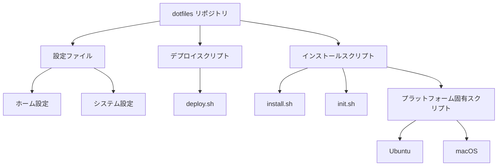

# システムパターン

## アーキテクチャ概要

dotfilesプロジェクトは以下の主要コンポーネントで構成されています：



## ディレクトリ構造

- `home/` - ホームディレクトリに配置される設定ファイル
- `config/` - システム全体の設定ファイル
- `installer/` - 各プラットフォーム向けのインストールスクリプト
  - `ubuntu/` - Ubuntu/Debian向けスクリプト
  - `osx/` - macOS向けスクリプト
- ルートディレクトリ - メインスクリプトと設定

## 設計パターン

### シンボリックリンク方式

設定ファイルはリポジトリ内で管理され、実際の場所にはシンボリックリンクが配置されます。これにより：

1. 設定の一元管理が可能
2. バージョン管理が容易
3. 変更の追跡と同期が簡単

### モジュール化されたインストールスクリプト

インストールプロセスは複数の小さなスクリプトに分割され、必要に応じて個別に実行できます：

1. 基本システムセットアップ
2. 開発ツールのインストール
3. 言語固有の環境構築
4. アプリケーションのインストール

### プラットフォーム検出と条件付き実行

スクリプトはプラットフォームを自動検出し、適切な処理を実行します：

```bash
# 例：プラットフォーム検出パターン
if [[ "$OSTYPE" == "darwin"* ]]; then
    # macOS固有の処理
elif [[ "$OSTYPE" == "linux-gnu"* ]]; then
    # Linux固有の処理
fi
```

### パーソナライズ層

`personal.sh`スクリプトにより、共通設定の上に個人固有のカスタマイズを適用できます。

## コンポーネント間の関係

- `deploy.sh` - 設定ファイルのシンボリックリンクを作成
- `install.sh` - 必要なソフトウェアをインストール
- `init.sh` - 初期セットアップを実行
- プラットフォーム固有スクリプト - OS固有の設定とインストール
